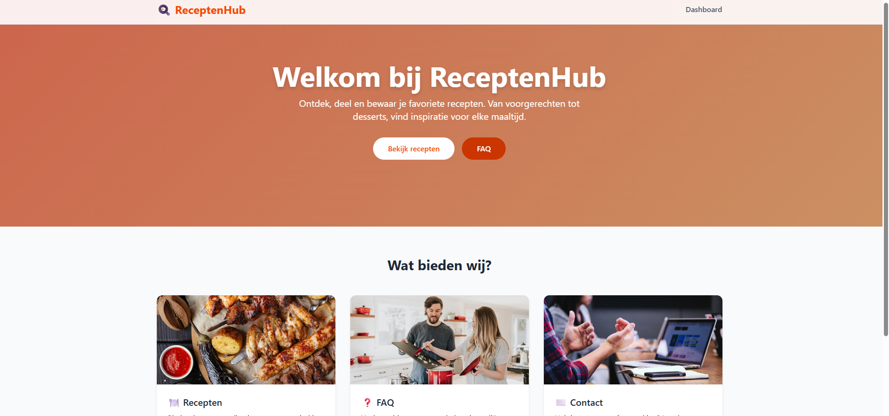
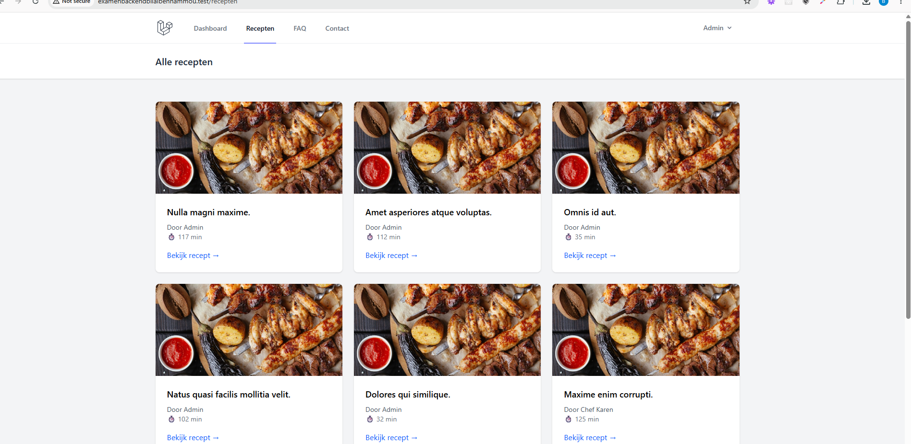
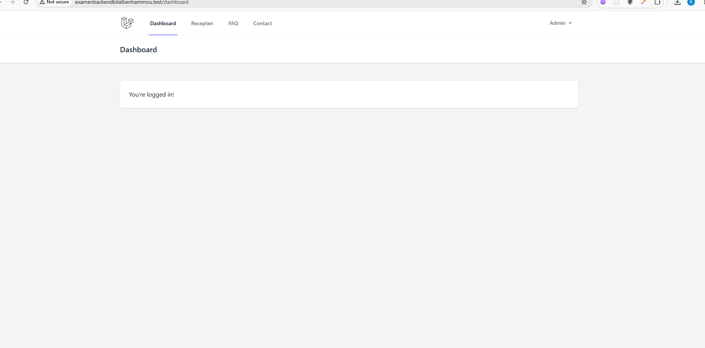
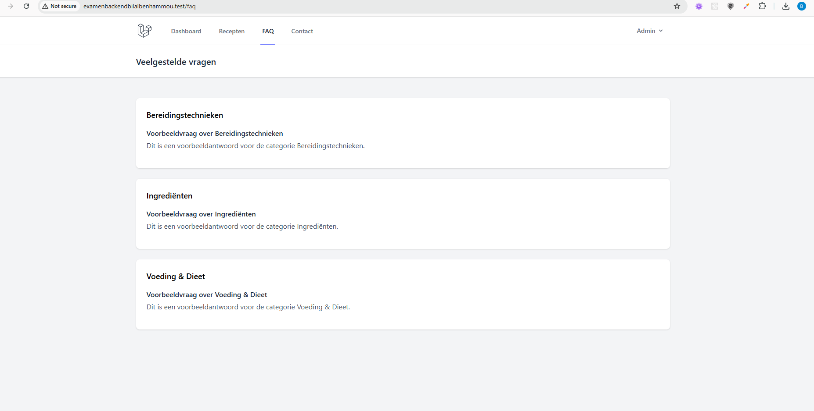
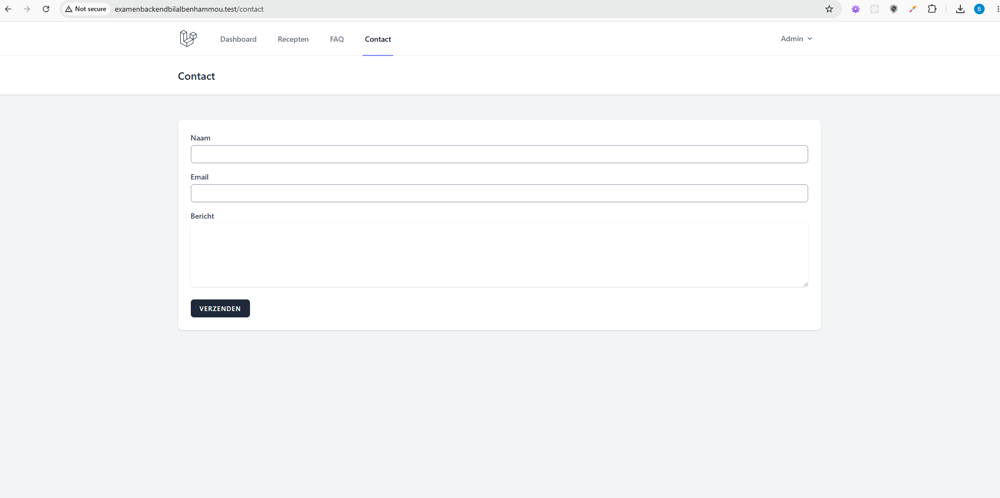
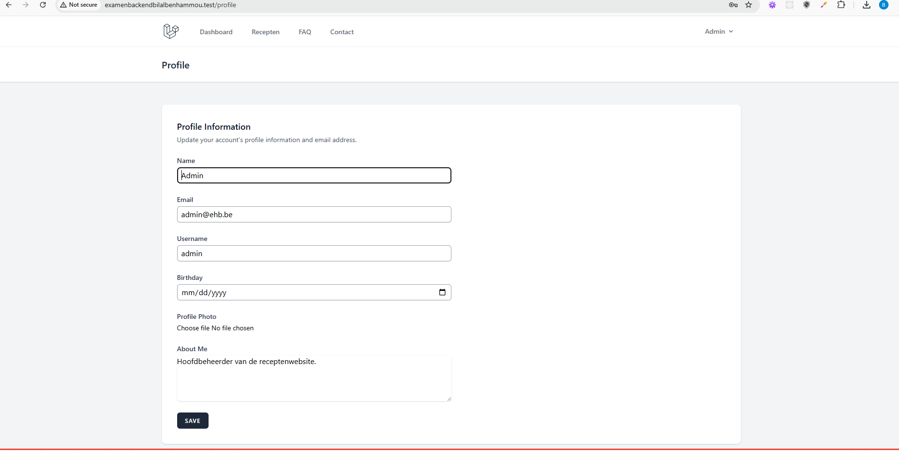

# ReceptenHub - Backend Web Eindopdracht

Een dynamische receptenwebsite gebouwd met Laravel 13 voor het vak Backend Web. Gebruikers kunnen recepten bekijken, FAQ raadplegen, contact opnemen en hun eigen profiel beheren. Admins hebben volledige controle over gebruikers, recepten, FAQ en contactberichten.

## Functionaliteiten

### Authenticatie
- Registreren, inloggen, uitloggen
- Wachtwoord resetten bij vergeten wachtwoord
- "Remember me" functionaliteit
- Twee rollen: gebruiker en admin

### Profielpagina
- Publiek profiel zichtbaar voor iedereen (`/profiel/{user}`)
- Ingelogde gebruiker kan eigen profiel bewerken
- Profielvelden: username, verjaardag, profielfoto, over-mij tekst

### Recepten (Nieuwtjes)
- Publieke receptenlijst met detailpagina
- Admin kan recepten aanmaken, bewerken en verwijderen
- Recepten bevatten: titel, afbeelding, ingrediënten, bereiding, kooktijd, publicatiedatum

### FAQ
- Publieke FAQ-pagina met vragen gegroepeerd per categorie
- Admin kan categorieën en vragen/antwoorden beheren

### Contact
- Contactformulier voor bezoekers
- Admin ontvangt een email bij elk nieuw bericht
- Admin dashboard om berichten te bekijken en beheren

## Technische vereisten

### Views
- **Twee layouts**: `app.blade.php` (ingelogd) en `guest.blade.php` (publiek)
- **Componenten**: Breeze componenten (`x-breeze.nav-link`, `x-breeze.dropdown`, etc.)
- **Control structures**: `@if`, `@foreach`, `@auth` in Blade views
- **XSS protectie**: Alle output via `{{ }}` Blade syntax
- **CSRF protectie**: `@csrf` op alle formulieren
- **Client-side validatie**: `required` attributen op formuliervelden

### Routes (`routes/web.php`)
- Alle routes gebruiken controller methods
- Routes gebruiken middleware (`auth`, `admin`, `verified`)
- Routes gegroepeerd per toegangsniveau: publiek, ingelogd, admin

### Controllers
- **Resource controllers**: `UserController`, `RecipeController`, `FaqCategoryController`, `FaqItemController`, `ContactMessageController`
- **Regular controllers**: `RecipeController` (publiek), `FaqController`, `ContactController`, `ProfileController`

### Models & Relaties
- `User` hasMany `Recipe` (one-to-many)
- `FaqCategory` hasMany `FaqItem` (one-to-many)
- `User` hasMany `Recipe` via `author()` relatie

### Database
- SQLite database
- Migraties voor alle tabellen: users, recipes, faq_categories, faq_items, contact_messages
- Seeder met default admin en testdata

## Installatiehandleiding

1. **Repository klonen**
   ```bash
   git clone https://github.com/BenhamBilal/examenBackendBilalBenhammou
   cd examenBackendBilalBenhammou
   ```

2. **Afhankelijkheden installeren**
   ```bash
   composer install
   npm install
   ```

3. **Omgevingsvariabelen**
   ```bash
   cp .env.example .env
   php artisan key:generate
   ```

4. **Database opzetten**
   ```bash
   php artisan migrate:fresh --seed
   ```

5. **Storage link** (voor afbeeldingen)
   ```bash
   php artisan storage:link
   ```

6. **Server starten**
   ```bash
   php artisan serve
   ```

7. **Default admin account**
   - Email: admin@ehb.be
   - Wachtwoord: Password!321

## Screenshots

- Welcome pagina

- Recepten overzicht

- Admin dashboard

- FAQ pagina

- Contactformulier

- Profiel pagina



## Gebruikte bronnen

- Laravel 13 documentatie (https://laravel.com/docs)
- Laravel Breeze (authenticatie scaffolding)
- Tailwind CSS (styling)
- Alpine.js (interactieve componenten)
- Unsplash (placeholder afbeeldingen)
- Laravel Boost (AI-assisted development)

## Ai gebruikt voor : 

- stijl, html  van views
- email beheer
- readme schrijven
- free use afbeeldingen van internet te genereren
- bugs debuggeren
- welcomepagina stijl

